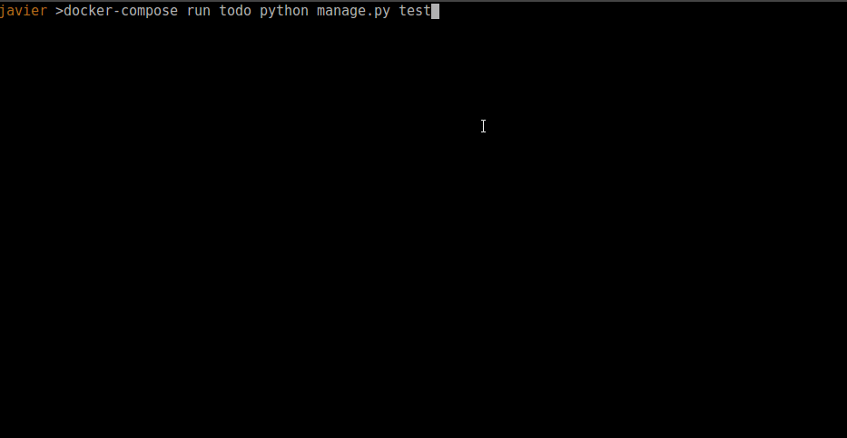
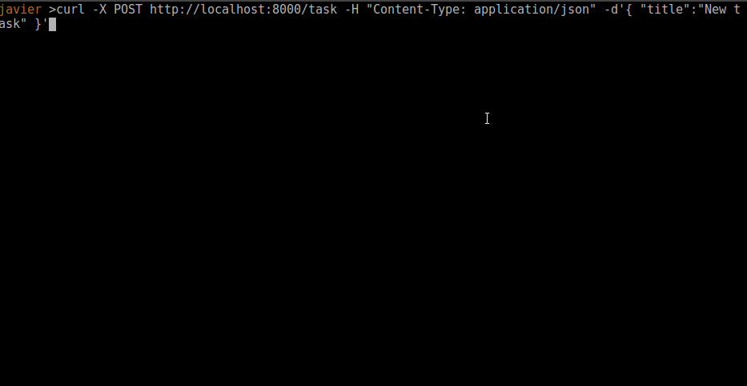

# Task management REST API template

This REST API powered by Django REST allows users to create, 
update and list tasks on a simple TODO manager app. 

The main purpose of this project is to server as template for future Django REST APIs.


Libraries and frameworks: 
 - Python 3.7 
 - Django REST framework 3.9.0 

## Endpoints

- GET /task list all tasks
- GET /task/[id] get task by id
- POST /task create new task 
- PUT /task/[id] update an existing task 
- DELETE /task/[id]

Extra endpoints for monitoring, useful when implementing a complex microservice stack:
- GET / return status and name of the app 
- GET /ping pong 

## Features 

- Full REST API on Django REST
- Database migrations 
- Status endpoints
- Postgres database on docker when running server
- Swagger doc


- Django admin 


- Friendly Django REST interface on the browser


### Project structure
This is the structure of the modules in the project, it follows the standard Django REST file naming, based on the model-view-controller pattern.

## Things to do next 

This is a list of this that should be done before moving to a full environment. 

- Add security to API (uses profiles, access token, private network...)
- Version API 
- Add error reporting system (eg: Sentry)
- continuous integration / continuous deploy
- BDD 

## Testing



    docker-compose run todo python manage.py test

## Run the server 


Before running the server, you will need to be running a postgres instance with a *todo* database, you can run it on your machine using docker with 

    dc run --service-ports todo

## Sample usage: create a task 



PK id UUID is generated automatically
```
curl -X POST http://localhost:8000/task -H "Content-Type: application/json" -d'{ "title":"New task" }'
```
